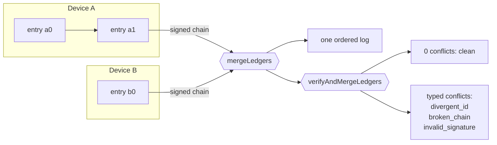

# @nkwib/ledger

Prove your offline app's history was not tampered with, and merge many writers verifiably. Zero dependencies.


> The package name `@nkwib/ledger` is a placeholder. Renaming is a one-line change in `package.json`.

## The 60-second pitch

Local-first and offline-first apps have a trust gap. Data is created on devices that
are offline, edited by different people, and synced later in any order. Two problems
fall out of that:

1. You cannot prove a record was not altered after it was written.
2. When several devices each hold part of the truth, you cannot merge them into one
   history that everyone can independently check.

CRDTs (Automerge, Yjs) solve merging but say nothing about authenticity: a peer can
rewrite history and the merge accepts it. Signed audit logs solve authenticity but
assume a single writer. `@nkwib/ledger` does both, with a deliberately small idea:

- Every device keeps an append-only **SHA-256 hash chain**. Change one field and the
  chain no longer verifies.
- Every entry is **signed** with the device's non-extractable ECDSA P-256 key. The
  device id is the hash of its own public key, so identity is self-certifying.
- Logs from any number of devices **merge deterministically** into one ordered log.
  Same result regardless of arrival order.
- Tampering, forks, and forged or missing signatures surface as **typed conflict
  flags**, not silent failures.

It is a substrate, not a framework: no storage, no network, no UI. You bring those;
the library gives you the verifiable core. It runs the same in a browser and in Node
(>= 20), touching only `globalThis.crypto.subtle`.

## Install

```sh
npm install @nkwib/ledger
# or: pnpm add @nkwib/ledger  /  yarn add @nkwib/ledger
```

ESM only. TypeScript types are included.

## Quickstart

Two devices sign entries, the logs merge, then one byte is tampered and verification
names the exact broken entry. This runs as-is on Node >= 20.

```js
import {
	generateDeviceKey, deviceIdentity, appendEntry, signEntry,
	mergeLedgers, verifyAndMergeLedgers, defaultCodec, defaultContent
} from '@nkwib/ledger';

const [a, b] = [await generateDeviceKey(), await generateDeviceKey()];
const [idA, idB] = [await deviceIdentity(a), await deviceIdentity(b)];

const sigs = {};
const put = async (key, dev, id, head, payload) => {
	const e = await appendEntry({ id, deviceId: dev.deviceId, ts: Date.now(), payload }, head);
	sigs[e.id] = await signEntry(key.privateKey, e, defaultContent);
	return e;
};
const a0 = await put(a, idA, 'a0', null, { athlete: 'ada', points: 2 });
const b0 = await put(b, idB, 'b0', null, { athlete: 'bo', points: 4 });

const { entries } = mergeLedgers([[a0], [b0]], defaultCodec);        // deterministic union
console.log(entries.length);                                        // 2

const registry = {
	[idA.deviceId]: { publicKeyJwk: idA.publicKeyJwk },
	[idB.deviceId]: { publicKeyJwk: idB.publicKeyJwk }
};
const tampered = { ...a0, payload: { athlete: 'ada', points: 999 } };  // flip one byte
const { conflicts } = await verifyAndMergeLedgers([[tampered], [b0]], defaultCodec, registry, sigs);
console.log(conflicts.map((c) => `${c.kind} -> ${c.entryId}`));
// [ 'broken_chain -> a0', 'invalid_signature -> a0' ]
```

## How it fits together



Each device appends to its own chain and signs each entry. Merge unions and orders
the logs deterministically; the crypto tier additionally verifies every chain and
signature and reports what failed and where.

## Features

- **Zero runtime dependencies.** Nothing to audit but this.
- **Isomorphic.** Browser and Node >= 20, via `globalThis.crypto.subtle` only.
- **WebCrypto only.** Real SHA-256 and ECDSA P-256, non-extractable private keys.
- **Deterministic merge.** Commutative and associative over the set of entries.
- **Typed conflicts.** `divergent_id`, `broken_chain`, `invalid_signature`. No silent
  resolution: you decide what to do.
- **Bring your own everything else.** Storage, transport, and UI are yours.
- **TypeScript strict**, generic over your payload: the library never sees your domain.

## When NOT to use this

This is a narrow tool. Reach for something else when your problem is a different shape.

| You need | Use instead | Why |
| --- | --- | --- |
| Rich collaborative merge (text, trees) without authenticity | [Automerge](https://automerge.org/), [Yjs](https://yjs.dev/) | CRDTs merge concurrent edits field by field, but accept whatever a peer sends. No tamper-evidence. |
| A tamper-evident log with a single writer | An append-only signed audit log | If only one party ever writes, you do not need cross-device merge. Simpler. |
| A full peer-to-peer append-only stack (replication, discovery, storage) | [Hypercore](https://holepunch.to/) | Hypercore is a whole P2P system. This library is just the verifiable core, transport-agnostic. |
| A server-side, publicly auditable transparency log | [Trillian](https://github.com/google/trillian) | Merkle-tree transparency logs assume a central, always-on verifiable server. This is offline-first and serverless. |
| Confidentiality (hiding contents) | An encryption layer | Signatures prove authorship, not secrecy. Payloads are plaintext. See the [threat model](./docs/threat-model.md). |

If you want deterministic multi-writer merge AND the ability to prove nobody rewrote
history, and you are offline-first, this is the fit.

## Documentation

- [Tutorial](./docs/tutorial.md): build a tiny multi-device scoreboard from zero.
- [How to verify entries and chains](./docs/howto-verify.md)
- [How to handle conflicts](./docs/howto-conflicts.md)
- [How to manage keys](./docs/howto-keys.md) (lifecycle, backup, non-extractable keys)
- [How to move entries between devices](./docs/howto-transport.md)
- [API reference](./docs/reference.md): every export, parameter, and typed error.
- [Threat model](./docs/threat-model.md): what this guarantees, and what it does NOT.
- [Design notes](./docs/design.md): why a hash chain plus signatures, not a CRDT or a blockchain.

Runnable examples live in [`examples/`](./examples): a Node script and a
dependency-free browser page.

## License

MIT. See [LICENSE](./LICENSE).
